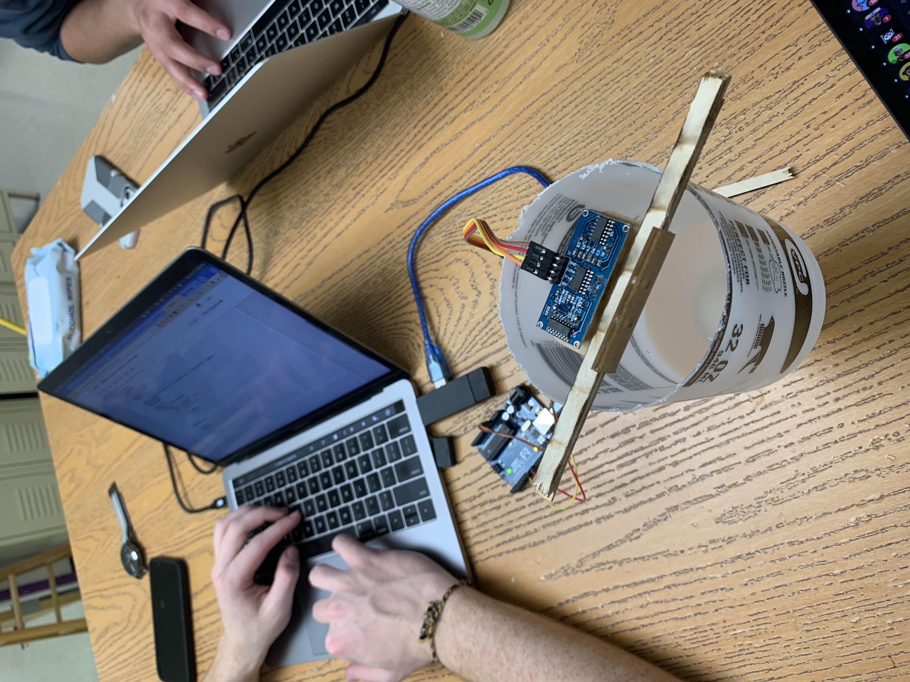

# Splash-322
CSC 322 Project #1 - Frank Whitworth and Andy Spiers

## What Pauca Wants
readme file with additional details for construction of the prototype and illustrations of the working prototype. 

## Materials
- 1x Arduino UNO
- 1x Ultrasonic Distance Sensor - HC-SR04 
- 1x Ultrasonic cover
- 4x Pin connector cables
- 1x USB-Arduino cable
- 1x Computer 
- 1x Plant
- 1x Vessel for water (spray bottle)

## Construction
<<<<<<< HEAD

=======

>>>>>>> 6c30170fe3c9848fa50129ca3bd6e18153f77c41
