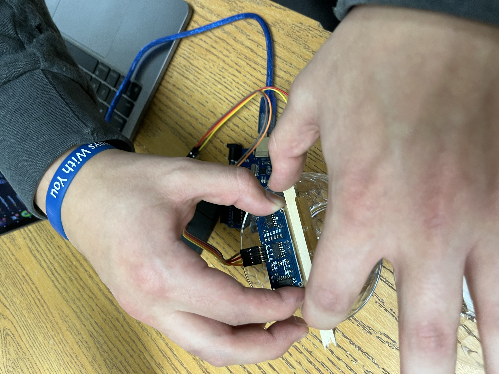
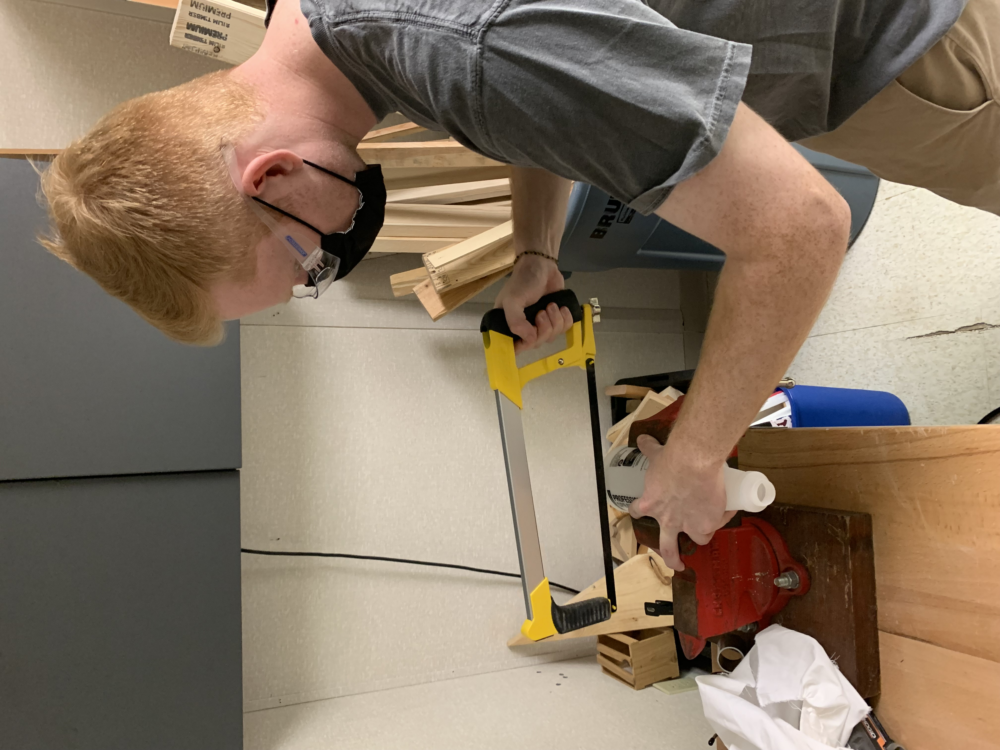
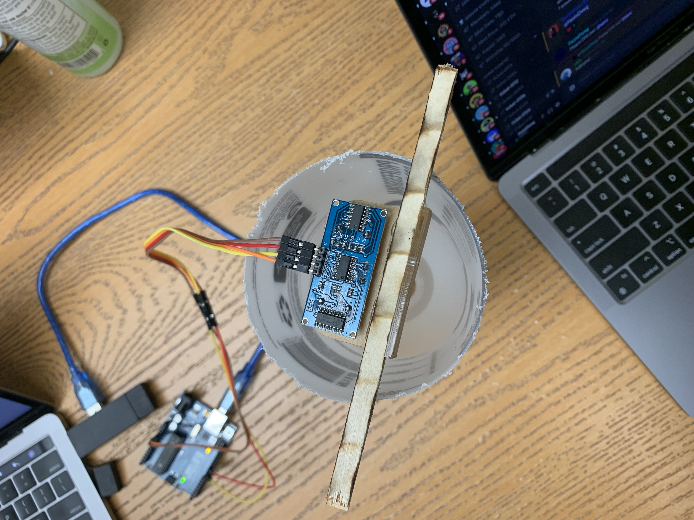

# Splash-322
CSC 322 Project #1 - Frank Whitworth and Andy Spiers

## What Pauca Wants
readme file with additional details for construction of the prototype and illustrations of the working prototype. 

## Problem
For this project, we developed a tool that will notify a user when their plant-watering tool needs more water. This tool will help visually impaired users, users with disabilities, and users that travel and are away from their plants for long periods of time. 

## Solution
Our solution will monitor users' plants' health and water level by utilizing an ultrasonic sensor with Python. Our tool is able to sense the water level inside the vessel, compare the actual water level to the trigger distance, and then send an email to the user once that trigger distance has been reached. 

## Materials
- 1x Arduino UNO
- 1x Ultrasonic Distance Sensor - HC-SR04 
- 1x Ultrasonic cover
- 4x Pin connector cables
- 1x USB-Arduino cable
- 1x Computer 
- 1x Plant
- 1x Vessel for water (spray bottle)

## Construction

### Circuit
1. This is an exact diagram of our circuit. We have decided to not use a bread board to save space in our prototype. The only differences are the ports that we mapped Echo and Trig to in our system. 

### Sensor Setup
1. Here we are putting the ultrasonic sensor inside of its case to test how it fits. Notice the little scrap bit of wood we used, this is to ensure even, stable, and consistent readings with our sensor. Overall a necessary addition to the prototype. 

2. Next, we decided to test if we could read different values with different water levels inside of a test setup. We used two little plastic cups for this experiment and found favorable results. We were able to detect the different water levels, leading us to continue developing our project. 

### Prototype Construction
1. Now that we know we can clearly distiguish the water levels, we moved on to developing our prototype. We decided to use a spray bottle for our water vessel. Here, Frank is cutting the end of the bottle where our sensor will be hanging over. 

2. After the bottle was cut, we put the sensor and the wood over the bottle to ensure a snug fit with the cut. 

3. Finally, it was time to test to see if our sensor would be able to read different water levels inside the vessel. Andy and Frank found favorable results! 

### DevOps
1. Finally, we were able to start the DevOps process. For this project, we needed to split this DevOps process into two steps - Arduino and Python.

2. First, we developed the arduino sketch. This will be important to keep running because this receives, interprets, and sends the readings that we get from the ultrasonic sensor.

3. The Arduino aspe